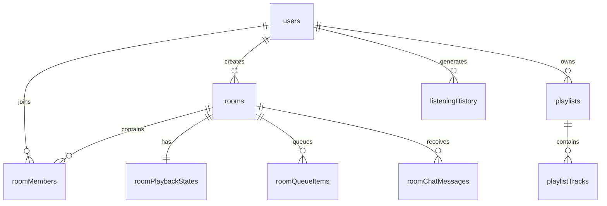

# SONICROOM — Database Design

> **Version**: 1.0 | **Database**: MongoDB + Mongoose

---

## 1. Collection Overview



---

## 2. Collections

### 2.1 `users`

```typescript
interface IUser {
  _id: ObjectId;
  username: string;          // unique, 3-30 chars
  email: string;             // unique, normalized
  passwordHash: string;      // bcrypt
  displayName: string;
  avatarUrl?: string;
  bio?: string;
  likedSongIds: string[];    // external track IDs
  createdAt: Date;
  updatedAt: Date;
}
```

**Indexes:**
| Index | Type | Purpose |
|-------|------|---------|
| `{ email: 1 }` | Unique | Login lookup |
| `{ username: 1 }` | Unique | Profile lookup |

---

### 2.2 `rooms`

```typescript
interface IRoom {
  _id: ObjectId;
  name: string;              // 1-50 chars
  description?: string;      // max 200 chars
  coverImageUrl?: string;
  createdBy: ObjectId;       // ref: users
  visibility: 'PUBLIC' | 'PRIVATE';
  joinMode: 'OPEN' | 'APPROVAL_REQUIRED';
  inviteCode: string;        // unique, 8 chars
  status: 'ACTIVE' | 'ENDED';
  listenerCount: number;     // denormalized, updated on join/leave
  currentTrackId?: string;   // denormalized for discovery display
  currentTrackName?: string; // denormalized for discovery display
  endedAt?: Date;
  createdAt: Date;
  updatedAt: Date;
}
```

**Indexes:**
| Index | Type | Purpose |
|-------|------|---------|
| `{ visibility: 1, status: 1 }` | Compound | Room discovery |
| `{ inviteCode: 1 }` | Unique | Join by code |
| `{ createdBy: 1, status: 1 }` | Compound | User's active rooms |
| `{ status: 1, listenerCount: -1 }` | Compound | Popular rooms |

---

### 2.3 `roomMembers`

Separate collection — NOT an embedded array in rooms.

```typescript
interface IRoomMember {
  _id: ObjectId;
  roomId: ObjectId;          // ref: rooms
  userId: ObjectId;          // ref: users
  role: 'ADMIN' | 'CONTROLLER' | 'MEMBER';
  status: 'ACTIVE' | 'LEFT' | 'REMOVED' | 'PENDING';
  joinedAt: Date;
  leftAt?: Date;
  updatedAt: Date;
}
```

**Indexes:**
| Index | Type | Purpose |
|-------|------|---------|
| `{ roomId: 1, userId: 1 }` | Unique | Prevent duplicate membership |
| `{ roomId: 1, status: 1 }` | Compound | List active members |
| `{ roomId: 1, role: 1 }` | Compound | Role queries |
| `{ userId: 1, status: 1 }` | Compound | User's active rooms |

---

### 2.4 `roomPlaybackStates`

One document per active room. This is the authoritative state.

```typescript
interface IRoomPlaybackState {
  _id: ObjectId;
  roomId: ObjectId;          // ref: rooms, unique
  currentTrackId: string | null;
  currentTrackMeta?: {
    name: string;
    artist: string;
    albumArt: string;
    duration: number;        // ms
  };
  status: 'PLAYING' | 'PAUSED' | 'IDLE';
  positionMs: number;        // position at stateTimestamp
  stateTimestamp: number;    // server time (ms) when position was recorded
  sequenceNumber: number;    // monotonically increasing
  updatedBy: ObjectId;       // ref: users
  updatedAt: Date;
}
```

**Indexes:**
| Index | Type | Purpose |
|-------|------|---------|
| `{ roomId: 1 }` | Unique | One state per room |

---

### 2.5 `roomQueueItems`

```typescript
interface IRoomQueueItem {
  _id: ObjectId;
  roomId: ObjectId;          // ref: rooms
  trackId: string;           // external track ID
  trackMeta: {
    name: string;
    artist: string;
    albumArt: string;
    duration: number;
  };
  addedBy: ObjectId;         // ref: users
  position: number;          // ordering index
  status: 'QUEUED' | 'PLAYING' | 'PLAYED' | 'REMOVED';
  createdAt: Date;
}
```

**Indexes:**
| Index | Type | Purpose |
|-------|------|---------|
| `{ roomId: 1, position: 1 }` | Compound | Ordered queue fetch |
| `{ roomId: 1, status: 1 }` | Compound | Active queue items |

---

### 2.6 `roomChatMessages`

```typescript
interface IRoomChatMessage {
  _id: ObjectId;
  roomId: ObjectId;          // ref: rooms
  userId: ObjectId;          // ref: users
  username: string;          // denormalized
  avatarUrl?: string;        // denormalized
  message: string;           // max 500 chars
  createdAt: Date;
}
```

**Indexes:**
| Index | Type | Purpose |
|-------|------|---------|
| `{ roomId: 1, createdAt: -1 }` | Compound | Chronological chat |

---

### 2.7 `playlists`

```typescript
interface IPlaylist {
  _id: ObjectId;
  userId: ObjectId;          // ref: users
  name: string;              // 1-50 chars
  description?: string;
  coverImageUrl?: string;
  trackCount: number;        // denormalized
  isPublic: boolean;
  createdAt: Date;
  updatedAt: Date;
}
```

**Indexes:**
| Index | Type | Purpose |
|-------|------|---------|
| `{ userId: 1, createdAt: -1 }` | Compound | User's playlists |

---

### 2.8 `playlistTracks`

```typescript
interface IPlaylistTrack {
  _id: ObjectId;
  playlistId: ObjectId;      // ref: playlists
  trackId: string;           // external track ID
  trackMeta: {
    name: string;
    artist: string;
    albumArt: string;
    duration: number;
  };
  position: number;          // ordering index
  addedAt: Date;
}
```

**Indexes:**
| Index | Type | Purpose |
|-------|------|---------|
| `{ playlistId: 1, position: 1 }` | Compound | Ordered tracks |
| `{ playlistId: 1, trackId: 1 }` | Unique | No duplicate tracks |

---

### 2.9 `listeningHistory`

```typescript
interface IListeningHistory {
  _id: ObjectId;
  userId: ObjectId;          // ref: users
  trackId: string;
  trackMeta: {
    name: string;
    artist: string;
    albumArt: string;
    duration: number;
  };
  source: 'PERSONAL' | 'ROOM';
  roomId?: ObjectId;         // if source is ROOM
  playedAt: Date;
  durationListenedMs: number;
}
```

**Indexes:**
| Index | Type | Purpose |
|-------|------|---------|
| `{ userId: 1, playedAt: -1 }` | Compound | Recent history |
| `{ userId: 1, trackId: 1 }` | Compound | Track frequency |

---

## 3. Design Decisions

### 3.1 Why `roomMembers` is a Separate Collection
- Avoids unbounded array growth in `rooms`
- Enables efficient role-based queries
- Supports proper indexing on `(roomId, userId)`
- Clean membership lifecycle (ACTIVE → LEFT/REMOVED)
- Better for concurrent operations

### 3.2 Why `playlistTracks` is Separate from `playlists`
- Playlists can contain hundreds of tracks
- Reordering individual tracks doesn't require loading the entire playlist
- Efficient pagination

### 3.3 Denormalized Fields
Some fields are denormalized for performance:
- `rooms.listenerCount` — avoids counting `roomMembers` on every discovery query
- `rooms.currentTrackId/Name` — discovery listing without joining `roomPlaybackStates`
- `roomChatMessages.username/avatarUrl` — avoids user join on every message render
- `playlists.trackCount` — avoids counting `playlistTracks`

These must be kept consistent via application-level updates.

### 3.4 Track Metadata Storage
External track metadata (`trackMeta`) is stored inline rather than referencing a local `songs` collection. This is because:
- Track data comes from an external API
- Caching strategy may change
- Avoids stale references if external IDs change

A `songs` cache collection may be added later for performance.

---

## 4. TTL / Cleanup Policies

| Collection | Policy |
|------------|--------|
| `roomChatMessages` | TTL index: 7 days after `createdAt` |
| `listeningHistory` | TTL index: 90 days (configurable) |
| `rooms` (ENDED) | Soft delete via status, hard cleanup after 30 days |
| `roomQueueItems` (PLAYED/REMOVED) | Cleanup with room |
