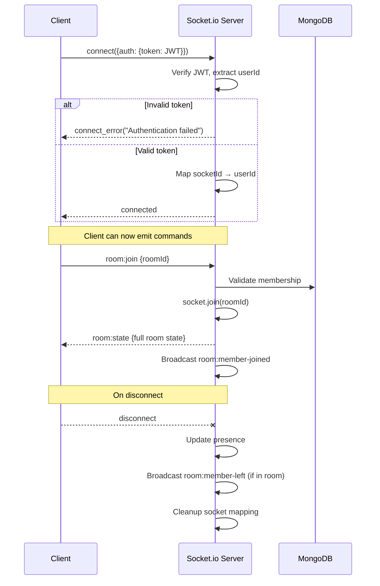
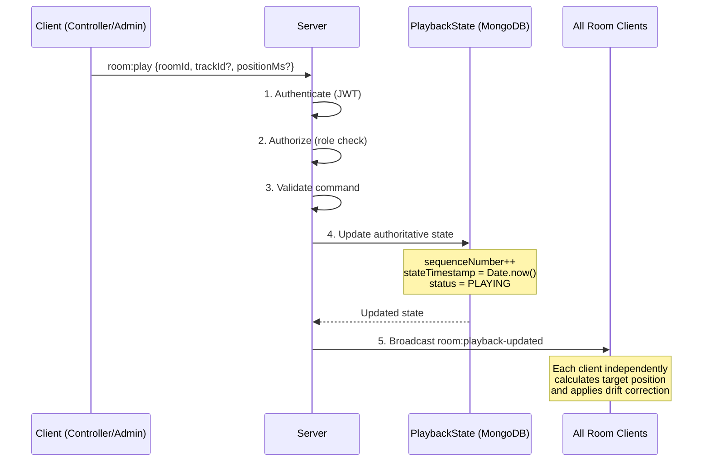
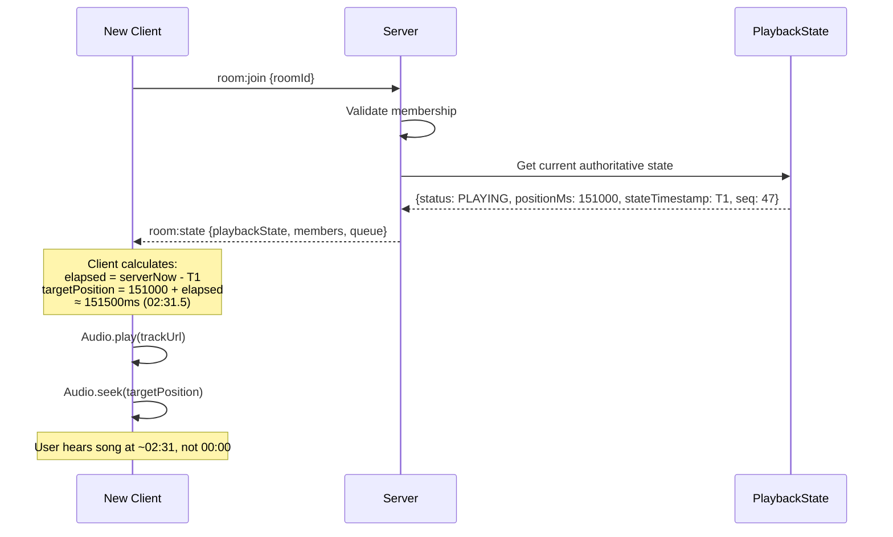
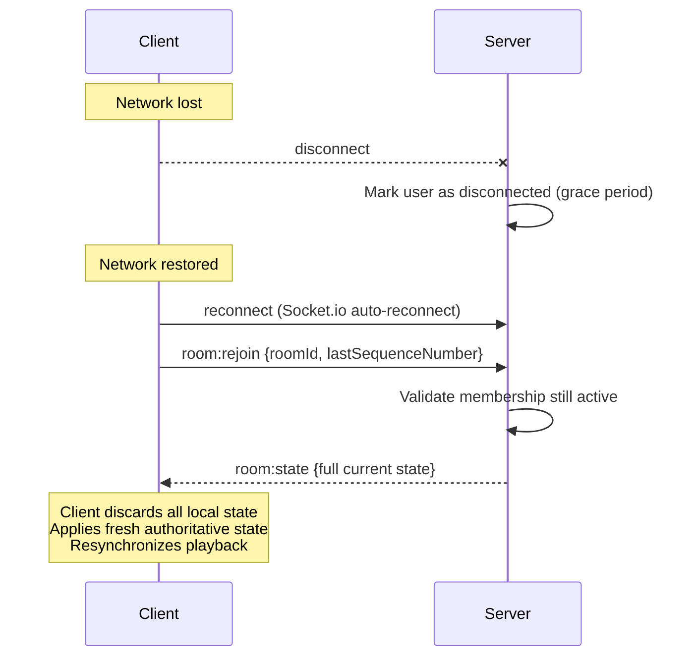

# SONICROOM — Realtime Architecture

> **Version**: 1.0 | **Protocol**: Socket.io over WebSocket

---

## 1. Overview

The realtime system is the backbone of SONICROOM. It handles:
- Synchronized playback across all room members
- Real-time chat delivery
- Ephemeral reaction broadcasting
- Room membership lifecycle events
- Queue updates

**Fundamental principle**: The server is **authoritative**. Clients are **reactive**.

---

## 2. Connection Lifecycle



---

## 3. Synchronized Playback Architecture

### 3.1 Command Flow



### 3.2 Authoritative Room Playback State

```typescript
interface AuthoritativePlaybackState {
  roomId: string;
  currentTrackId: string | null;
  status: 'PLAYING' | 'PAUSED' | 'IDLE';
  positionMs: number;           // position at stateTimestamp
  stateTimestamp: number;       // server Date.now() when positionMs was set
  sequenceNumber: number;       // monotonically increasing
  updatedBy: string;            // userId
  currentTrackMeta?: {
    name: string;
    artist: string;
    albumArt: string;
    duration: number;
  };
}
```

### 3.3 Server-Side State Update Logic

```typescript
// Pseudocode for playback command handling
function handlePlayCommand(roomId: string, userId: string, payload: PlayPayload) {
  // 1. Verify user has ADMIN or CONTROLLER role
  const member = await RoomMember.findOne({ roomId, userId, status: 'ACTIVE' });
  if (!member || !['ADMIN', 'CONTROLLER'].includes(member.role)) {
    throw new PermissionError('Insufficient permissions');
  }

  // 2. Get current state
  const state = await RoomPlaybackState.findOne({ roomId });

  // 3. Calculate new state
  const now = Date.now();
  const newState = {
    status: 'PLAYING',
    positionMs: payload.positionMs ?? state.positionMs,
    stateTimestamp: now,
    sequenceNumber: state.sequenceNumber + 1,
    updatedBy: userId,
    updatedAt: new Date(),
  };

  // 4. If track change, update track info
  if (payload.trackId && payload.trackId !== state.currentTrackId) {
    newState.currentTrackId = payload.trackId;
    newState.positionMs = 0;
    newState.currentTrackMeta = await fetchTrackMeta(payload.trackId);
  }

  // 5. Atomic update
  await RoomPlaybackState.findOneAndUpdate({ roomId }, { $set: newState });

  // 6. Broadcast to room
  io.to(roomId).emit('room:playback-updated', newState);
}
```

---

## 4. Client-Side Synchronization

### 4.1 Clock Offset Estimation

Clients must estimate the difference between server time and local time.

```typescript
// Client sends ping with local timestamp
// Server responds with server timestamp
// Client calculates offset

interface ClockSyncSample {
  sentAt: number;        // client local time when sent
  serverTime: number;    // server's Date.now() in response
  receivedAt: number;    // client local time when received
}

function calculateClockOffset(samples: ClockSyncSample[]): number {
  // For each sample:
  // roundTrip = receivedAt - sentAt
  // oneWayLatency = roundTrip / 2
  // offset = serverTime - (sentAt + oneWayLatency)
  //        = serverTime - sentAt - roundTrip/2

  const offsets = samples.map(s => {
    const roundTrip = s.receivedAt - s.sentAt;
    return s.serverTime - s.sentAt - roundTrip / 2;
  });

  // Use median to reject outliers
  offsets.sort((a, b) => a - b);
  return offsets[Math.floor(offsets.length / 2)];
}

function estimatedServerTime(): number {
  return Date.now() + clockOffset;
}
```

**Protocol**: Client emits `sync:ping` → Server responds `sync:pong` with server timestamp. Run 5 samples on connect, then every 30 seconds.

### 4.2 Position Calculation

```typescript
function calculateExpectedPosition(state: AuthoritativePlaybackState): number {
  if (state.status === 'PAUSED' || state.status === 'IDLE') {
    return state.positionMs;
  }

  const serverNow = estimatedServerTime();
  const elapsed = serverNow - state.stateTimestamp;
  return state.positionMs + elapsed;
}
```

### 4.3 Drift Correction

```typescript
interface DriftConfig {
  ignoreThresholdMs: number;     // default: 100
  gentleThresholdMs: number;     // default: 500
  gentleCorrectionRate: number;  // default: 1.05 or 0.95
}

function correctDrift(
  currentPositionMs: number,
  expectedPositionMs: number,
  config: DriftConfig
): DriftAction {
  const drift = expectedPositionMs - currentPositionMs;
  const absDrift = Math.abs(drift);

  if (absDrift < config.ignoreThresholdMs) {
    return { type: 'NONE' };
  }

  if (absDrift < config.gentleThresholdMs) {
    // Speed up or slow down playback rate slightly
    const rate = drift > 0 ? config.gentleCorrectionRate : (2 - config.gentleCorrectionRate);
    return { type: 'ADJUST_RATE', playbackRate: rate };
  }

  // Hard seek for large drift
  return { type: 'SEEK', targetMs: expectedPositionMs };
}
```

### 4.4 Sequence Number Validation

```typescript
class PlaybackStateManager {
  private lastSequenceNumber: number = -1;

  handleStateUpdate(state: AuthoritativePlaybackState): boolean {
    if (state.sequenceNumber <= this.lastSequenceNumber) {
      // Stale update — ignore
      console.warn(`Ignoring stale state: seq ${state.sequenceNumber} <= ${this.lastSequenceNumber}`);
      return false;
    }

    this.lastSequenceNumber = state.sequenceNumber;
    this.applyState(state);
    return true;
  }
}
```

---

## 5. Late Join Flow



---

## 6. Reconnection Flow



**Grace period**: Disconnected users remain "in room" for 60 seconds. If they don't reconnect, they're marked as LEFT and a `room:member-left` event is broadcast.

---

## 7. Conflict Resolution

### 7.1 Simultaneous Commands
If two controllers send commands at the same time:
- Server processes them sequentially (single-threaded Node.js event loop)
- Each gets a unique incrementing sequence number
- Second command builds on the state produced by the first
- No conflicts possible at the server level

### 7.2 Stale Commands
Client may send a command based on outdated state:
- Server always uses current DB state as the base
- The command payload specifies intent (e.g., "pause"), not target state
- Server calculates the correct position at the time of processing

---

## 8. Room Channel Architecture (Socket.io)

```typescript
// Server-side room management using Socket.io rooms

// Joining: socket enters the room channel
socket.join(`room:${roomId}`);

// Leaving: socket exits the room channel
socket.leave(`room:${roomId}`);

// Broadcasting to room:
io.to(`room:${roomId}`).emit('room:playback-updated', state);

// Broadcasting to room except sender:
socket.to(`room:${roomId}`).emit('room:chat-message', message);
```

---

## 9. Rate Limiting

| Event | Limit | Window |
|-------|-------|--------|
| `room:chat` | 20 messages | per minute |
| `room:reaction` | 30 reactions | per minute |
| `room:play/pause/seek` | 10 commands | per minute |
| `room:add-queue` | 15 additions | per minute |
| `room:join` (requests) | 5 requests | per minute |

Rate limits are enforced server-side per user per room.

---

## 10. Sync Timing Diagram

```
Server Time:  T0 -------- T1 -------- T2 -------- T3
              |            |            |            |
Admin plays   |            |            |            |
at T0:        |            |            |            |
pos=30000ms   |            |            |            |
              |            |            |            |
Client A      |   receives |            |            |
(20ms RTT)    |   at T0+10 |            |            |
              |   plays at |            |            |
              |   30010ms  |            |            |
              |            |            |            |
Client B      |            | receives   |            |
(100ms RTT)   |            | at T0+50   |            |
              |            | plays at   |            |
              |            | 30050ms    |            |
              |            |            |            |
Client C      |            |            | joins at T2|
(late join)   |            |            | gets state |
              |            |            | calculates |
              |            |            | pos=30000  |
              |            |            |   +(T2-T0) |
```

All clients converge to approximately the same playback position.
