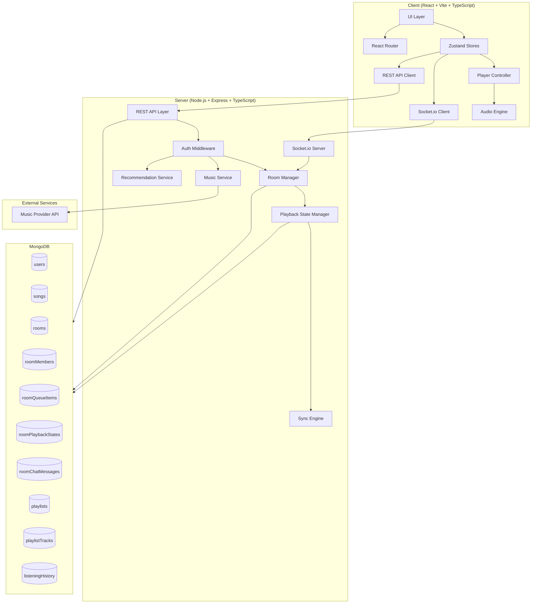
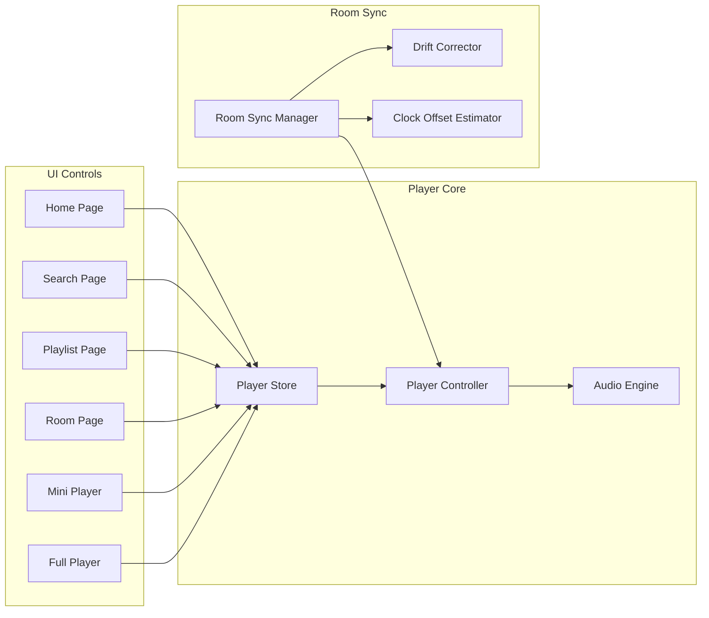
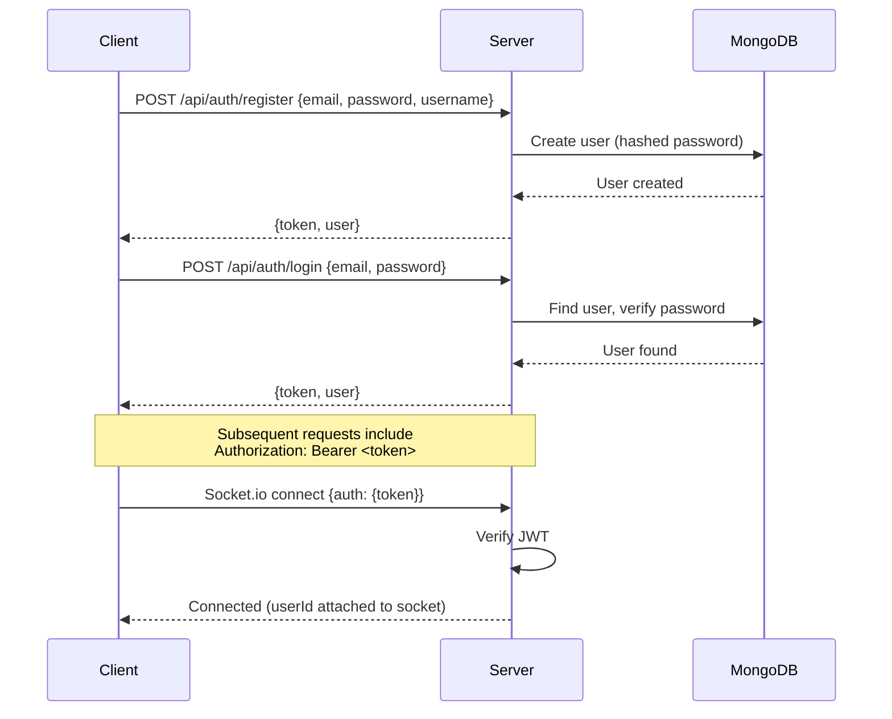

# SONICROOM — System Architecture

> **Version**: 1.0 | **Status**: Draft

---

## 1. High-Level Architecture



---

## 2. Monorepo Structure

```
sonicroom/
├── packages/
│   ├── shared/              # Shared types, constants, validation
│   │   └── src/
│   │       ├── types/       # TypeScript interfaces shared across client/server
│   │       ├── constants/   # Shared constants (roles, events, limits)
│   │       └── validation/  # Shared validation schemas (zod)
│   ├── client/              # React + Vite frontend
│   │   ├── src/
│   │   │   ├── app/         # App shell, router, providers
│   │   │   ├── components/  # Reusable UI components
│   │   │   ├── features/    # Feature modules (auth, player, room, etc.)
│   │   │   ├── stores/      # Zustand stores
│   │   │   ├── services/    # API clients, socket service
│   │   │   ├── hooks/       # Custom React hooks
│   │   │   ├── lib/         # Utilities, audio engine, sync
│   │   │   └── styles/      # Global styles, Tailwind config
│   │   ├── public/
│   │   ├── index.html
│   │   ├── vite.config.ts
│   │   ├── tailwind.config.ts
│   │   └── tsconfig.json
│   └── server/              # Node.js + Express backend
│       ├── src/
│       │   ├── app.ts       # Express app setup
│       │   ├── server.ts    # Entry point
│       │   ├── config/      # Environment config
│       │   ├── middleware/   # Auth, rate-limit, error handling
│       │   ├── routes/      # REST route definitions
│       │   ├── controllers/ # Request handlers
│       │   ├── services/    # Business logic
│       │   ├── models/      # Mongoose models
│       │   ├── socket/      # Socket.io handlers
│       │   │   ├── index.ts
│       │   │   ├── roomHandler.ts
│       │   │   ├── playbackHandler.ts
│       │   │   ├── chatHandler.ts
│       │   │   └── reactionHandler.ts
│       │   └── utils/       # Helpers
│       ├── tsconfig.json
│       └── package.json
├── docs/                    # Architecture documents
├── package.json             # Root workspace config
└── tsconfig.base.json       # Shared TS config
```

---

## 3. Client Architecture

### 3.1 State Management (Zustand)

| Store | Responsibility |
|-------|---------------|
| `authStore` | User session, JWT token, profile |
| `playerStore` | Playback state, current track, queue, mode (PERSONAL/ROOM) |
| `roomStore` | Active room state, members, roles, join status |
| `roomPlaybackStore` | Authoritative room playback state, sync metadata |
| `chatStore` | Room chat messages |
| `musicStore` | Search results, trending, recommendations |
| `uiStore` | Navigation state, modals, toasts |

### 3.2 Player Architecture



**Key rule**: There is ONE `AudioEngine` instance. All playback (personal or room) flows through the same `PlayerController` → `AudioEngine` pipeline. The `RoomSyncManager` intercepts and overrides controls when in ROOM mode.

### 3.3 Playback Modes

```typescript
type PlaybackMode = 'PERSONAL' | 'ROOM';

// When entering a room:
// 1. Pause personal playback
// 2. Store personal queue state
// 3. Switch mode to ROOM
// 4. Audio engine now controlled by RoomSyncManager

// When leaving a room:
// 1. Disconnect room sync
// 2. Switch mode to PERSONAL
// 3. Optionally restore personal queue
```

---

## 4. Server Architecture

### 4.1 Layer Separation

```
HTTP Request → Router → Auth Middleware → Controller → Service → Model → MongoDB
WebSocket    → Socket.io → Auth Middleware → Handler → Service → Model → MongoDB
```

### 4.2 Key Server Components

| Component | Responsibility |
|-----------|---------------|
| `AuthService` | Registration, login, JWT issuance/verification |
| `MusicService` | Proxy to external music API, caching, search |
| `RoomService` | Room CRUD, membership, visibility, join logic |
| `PlaybackService` | Authoritative playback state, command validation |
| `QueueService` | Room queue management, ordering |
| `ChatService` | Message validation, persistence, delivery |
| `RecommendationService` | Deterministic recommendations (pluggable) |
| `SocketManager` | Socket.io connection lifecycle, room channels |

### 4.3 Authentication Flow



---

## 5. Music Provider Abstraction

```typescript
interface MusicProvider {
  search(query: string, options?: SearchOptions): Promise<SearchResult>;
  getTrack(trackId: string): Promise<Track>;
  getTrackStreamUrl(trackId: string, quality?: AudioQuality): Promise<string>;
  getAlbum(albumId: string): Promise<Album>;
  getArtist(artistId: string): Promise<Artist>;
  getPlaylist(playlistId: string): Promise<ExternalPlaylist>;
  getTrending(options?: TrendingOptions): Promise<Track[]>;
}
```

Initial implementation: **JioSaavn** provider. The abstraction allows swapping to Spotify, YouTube Music, or any other provider later.

---

## 6. Security Architecture

| Layer | Mechanism |
|-------|-----------|
| Authentication | JWT (access tokens), bcrypt password hashing |
| REST API authorization | Auth middleware on all protected routes |
| Socket authorization | JWT verification on connection handshake |
| Room permissions | Server-side role validation on every socket command |
| Input validation | Zod schemas on all inputs (shared package) |
| Rate limiting | Per-user rate limits on chat, reactions, room creation |
| Secrets | Environment variables only, never committed |
| CORS | Configured origin whitelist |

---

## 7. Environment Configuration

```typescript
// server/src/config/env.ts
interface AppConfig {
  port: number;
  mongoUri: string;
  jwtSecret: string;
  jwtExpiresIn: string;
  corsOrigin: string;
  musicProvider: 'jiosaavn';  // extensible
  rateLimits: {
    chatMessagesPerMinute: number;
    reactionsPerMinute: number;
    roomCreationsPerHour: number;
    joinRequestsPerMinute: number;
  };
  sync: {
    driftThresholdIgnoreMs: number;   // 100
    driftThresholdGentleMs: number;   // 500
    clockSyncIntervalMs: number;      // 30000
    clockSyncSamples: number;         // 5
  };
}
```

---

## 8. Product Name Isolation

All user-facing product name references will use a single constant:

```typescript
// packages/shared/src/constants/brand.ts
export const BRAND = {
  name: 'SonicRoom',
  tagline: 'Listen Together',
  // ... other brand strings
} as const;
```

Changing the product name requires editing only this file.
